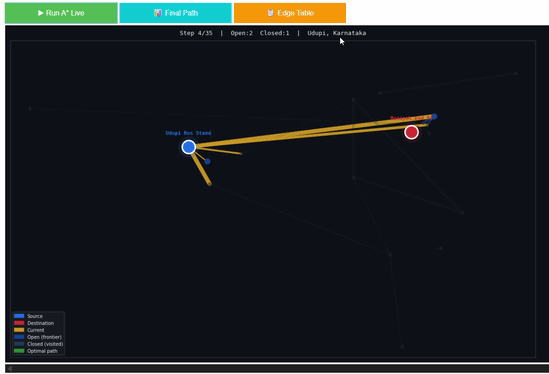
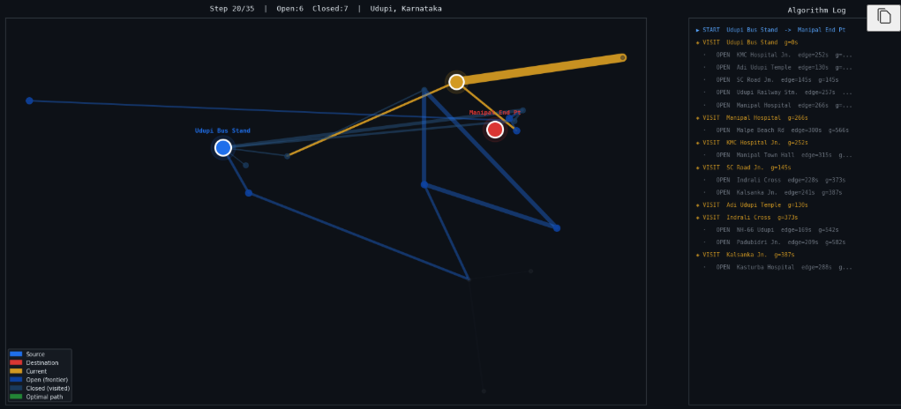
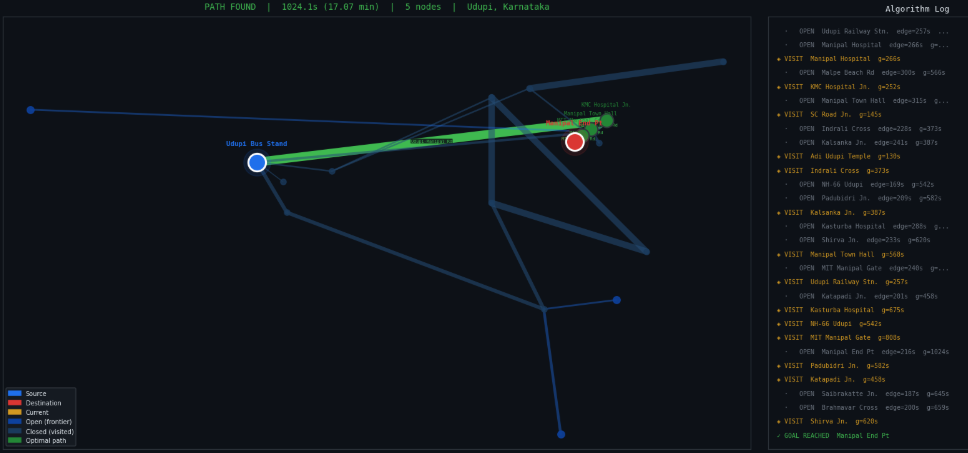
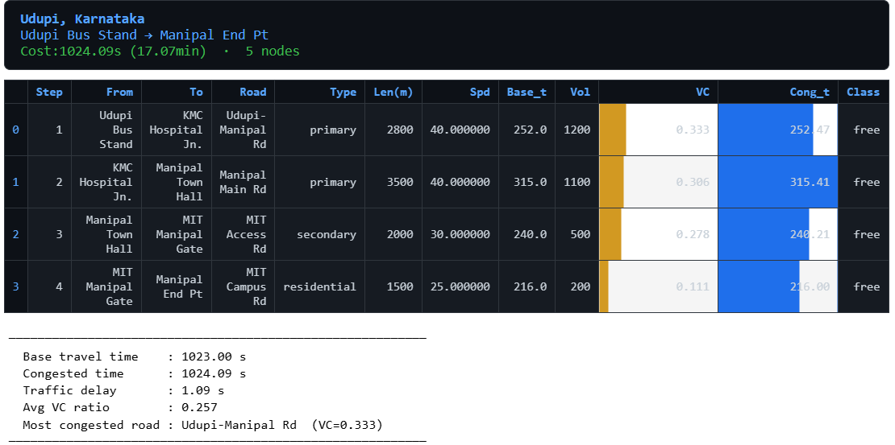
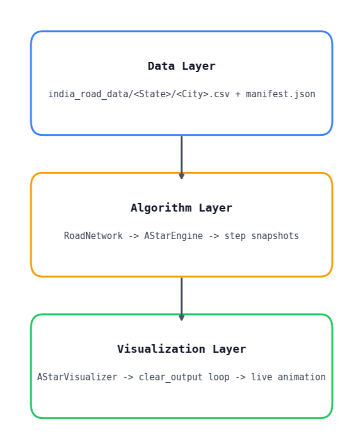
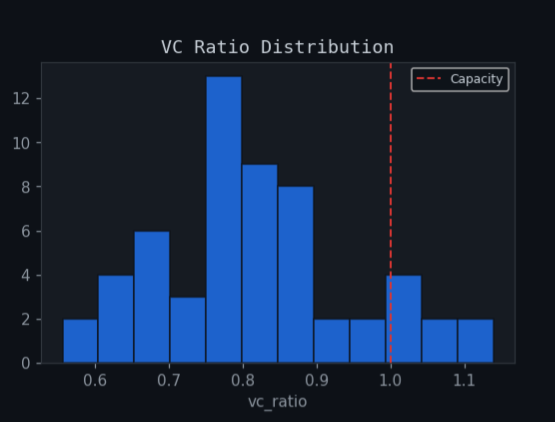
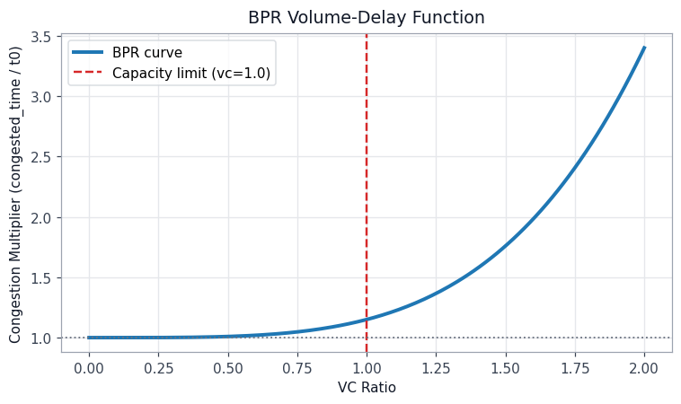
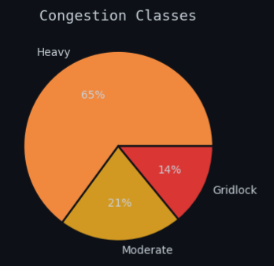

# A* Traffic Routing Simulator

A Python traffic-aware routing simulator that computes optimal driving routes across multiple Indian cities using the A* search algorithm. The project combines real road network data with traffic-aware edge costs to demonstrate intelligent route planning.

> **Note**
>
> This repository contains the final submission for a university group project completed as part of the **Introduction to Artificial Intelligence** course.
>
> The routing engine and traffic simulation components were developed collaboratively by the team.
>
> **My primary contribution** was creating the visualization pipeline and analytical plots used to present and evaluate the routing results.

---

## Demo

<p align="center">
  
</p>

---

## Screenshots

### Live Route Search

Animated visualisation of the A* search algorithm exploring the road network.

<p align="center">
  
</p>

---

### Final Route

Traffic-aware optimal route computed after the search completes.

<p align="center">
  
</p>

---

### Route Statistics

Detailed road segment statistics and congestion metrics for the selected route.

<p align="center">
  
</p>

---

## Features

- A* shortest path search
- Traffic-aware route optimization
- Multi-city support across India
- Interactive city selection
- Animated pathfinding visualisation
- Dataset generation utilities
- Modular Python implementation

--- 

## Project Structure

```
Traffic-Aware-Router/
├── assets/
│   ├── demo.gif
│   ├── img1.png
│   ├── img2.png
│   └── ...
├── astar_router.py              # Main routing application
├── generate_city_csvs.py        # Dataset generation utility 
├── astar_traffic_routing.ipynb  # Development notebook
├── india_road_data/
│   ├── manifest.json
│   ├── Karnataka/
│   ├── Maharashtra/
│   └── ...
├── README.md
├── requirements.txt
└── .gitignore

```

---

## System Architecture

The overall workflow of the routing system is illustrated below.

<p align="center">
  
</p>

--- 

## Algorithm

The project uses the **A\*** search algorithm.

Each road segment is assigned a traversal cost based on: 

- Distance
- Estimated travel time
- Traffic conditions

The heuristic estimates the remaining distance to the destination, allowing A* to efficiently find near-optimal routes while exploring significantly fewer nodes than uninformed search algorithms.

---

## Traffic Modeling & Analysis

To better approximate real-world driving conditions, the simulator models road congestion using standard traffic engineering metrics.

Traffic conditions are estimated using:
- Volume-to-Capacity (VC) ratio
- Bureau of Public Roads (BPR) delay function
- Congestion classification

### VC Ratio Distribution

<p align="center">
  
</p>

### BPR Delay Function

<p align="center">
  
</p>

### Congestion Classes

<p align="center">
  
</p>

---

## Installation

Clone the repository:

```bash
git clone https://github.com/P-Srisha/Traffic-Aware-Router.git
cd Traffic-Aware-Router
```

Create a virtual environment (recommended):

```bash
python -m venv .venv
```

Activate it.


**Windows**

```bash
.venv\Scripts\activate
```

**Linux / macOS**

```bash
source .venv/bin/activate
```

Install dependencies:

```bash
pip install -r requirements.txt
```

---

## Usage

Run the routing simulator:

```bash
python astar_router.py
```

Or open the notebook:

```bash
jupyter notebook astar_traffic_routing.ipynb
```

---

## Dataset

The repository contains road network datasets for multiple Indian cities.

The `generate_city_csvs.py` script can be used to generate or regenerate the CSV datasets used by the routing engine.

---

## Future Improvements

- Dynamic live traffic APIs
- Multiple routing algorithms
- Turn penalties
- Route comparison analytics
- Web interface

---

## Technologies

- Python
- NumPy
- Pandas
- Matplotlib
- Jupyter Notebook
